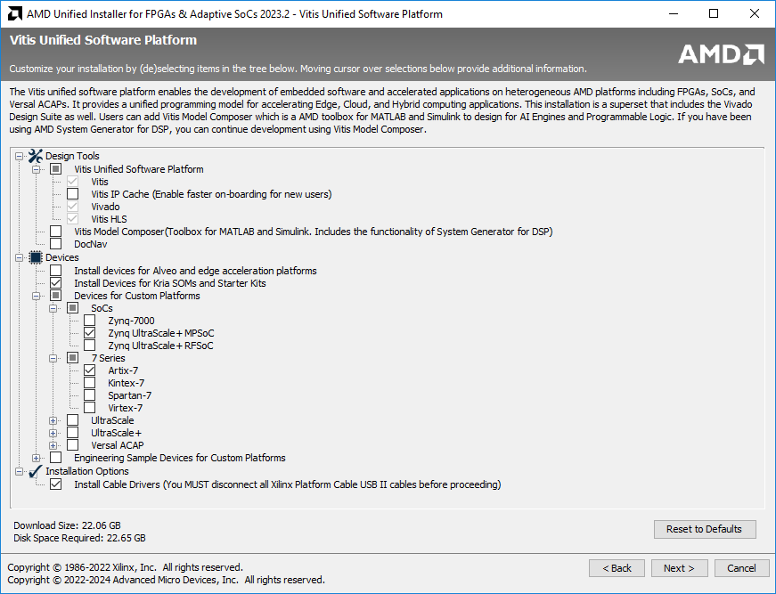

## Installing Vitis 2023.2

The complete development suite from AMD/Xilinx is also called Vitis, which includes Vivado - i.e., if you install Vitis, Vivado also gets installed. Vitis is used for the software part, Vivado is used for the hardware part.

Installation in Linux is recommended, especially if you want to explore more. Some tools/features such as AI Engine Development Flow, Petalinux, etc are available only for Linux. The performance and stability are generally better under Linux too. The basic requirements in EE4218 can be met by a Windows installation. WSL2 seems to work too but YMMV.

Vitis IDE is switching from being Eclipse-based to Visual Studio Code-based. However, we still recommend the Eclipse-based 'Vitis Classic' IDE as the VS based 'Vitis IDE' one does have shortcomings (e.g.: driver generation for peripherals in PL). Newer (2024.x) versions of Vitis based on Visual Studio code seems to be ok though.

It is **not recommended** to install on MacOS through a virtual machine. If you use a Mac, install Windows and/or Linux for a dual/triple boot.

Any version of Vivado is good enough for lab 1. For later labs, use the recommended version.

Some features of Vitis HLS require installing a free license, which has to be generated on the Xilinx/AMD website. Instructions for that are in the last section of this page. This is not needed for the first 3 labs, so you can install the license later too.

### Windows

Below are the steps to be followed to install **Xilinx Vitis 2023.2**. The instructions are for web installer, which is recommended to avoid the hassle of downloading the full installer and uncompressing it.

* You need a Xilinx account. If you don't, please create one.

* Xilinx unified web installer is downloadable from Xilinx website (Google for it).

* Run the downloaded file.

* Click Next, and enter your Xilinx account details. In the selection below, choose 'Download and Install Now'.

* Agree all the license agreements on the next page.

* On the next page, select Vitis.

* On the next page, click Next.

* Do the selection as given in the screenshot below. Must haves are Vitis, Vivado, Vitis HLS, Install Devices for Kria SOMs and Starter Kits, Zynq UltraScale+ MPSoC, Install Cable Drivers.

  * Artix-7 should be selected if you plan to take CG3207/EE2026/CS2100DE in the future, else uncheck it.

  * If you plan to try Alveo on Nimbix cloud in the future, select that too. It is unnecessary for EE4218 labs.

* Click Next and Select a suitable directory, Next, and Install. If you are prompted to allow installation of some hardware, firewall warnings about opening certain ports, etc, simply click allow without changing the default options. This may also happen during the first run of certain tools after installation. Make sure you allow or you will have a tough time fixing it later.

* When the installation is completed, click Finish to close the wizard.

### Linux

Vitis/Vivado works very well in RHEL (best-supported)/Fedora/Ubuntu. The instructions below are for Ubuntu.

* You need a Xilinx account. If you don't, please create one.

* Xilinx unified web installer for Linux is downloadable from Xilinx website (Google for it).

* cd to download directory

* chmod +x .bin. No need sudo unless you want to install in the default /opt directory. It is fine to install under /home/, and sudo is not needed. Please make sure you install to an Ext4 directory, not NTFS.

* Select the options as detailed in the Windows section above and complete the installation.

* If the desktop icon does not work or if you are ssh-ing into a remote Linux system with x forwarding, in command line : source //Xilinx/Vivado/2023.2/settings64.sh, followed by the command vivado.

* Additional libraries such as libtinfo5 may need to be installed. If starting from GUI fails, run from command line to identify the missing library and install it.

If you want to be able to access local hardware, do the following. If you are using FPGA remotely, this is not needed.

* //Xilinx/Vitis/2023.2/data/xicom/cable\_drivers/lin64/install\_script/install\_drivers

* Do sudo adduser $USER dialout if you want to be able to access local hardware without sudo.

* If you have trouble connecting to the board even after that, perhaps you should run sudo ufw allow 3121/tcp.

## Installing Vitis HLS License

Go to [https://www.xilinx.com/getlicenseLinks](https://www.xilinx.com/getlicense). Login, fill up the license form.

Under Certificate based license > Vivado HLS License > Generate Node-Locked License > System Information > Host ID > Enter the details.

Host ID is your PC/Laptop hostname. Select the appropriate OS. Select Host ID Type as Ethernet MAC. Put in your MAC address as the Host ID value. You can find the MAC address using the ipconfig /all command in windows (search for cmd in the start menu) and ifconfig command in Linux. Click Add and Next, Next.

You can now download the license file . It will also be emailed to you.

Now, in the start menu, open Xilinx Design Tools > Manage Licenses 2023.2. Now Get License > Load License > Copy License, and navigate to and select the .lic file. Restart all Xilinx programs (Vivado/Vitis, etc). Done!
