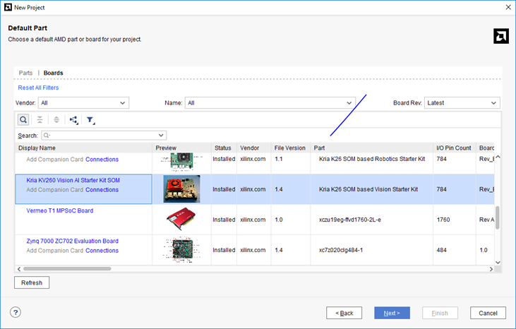
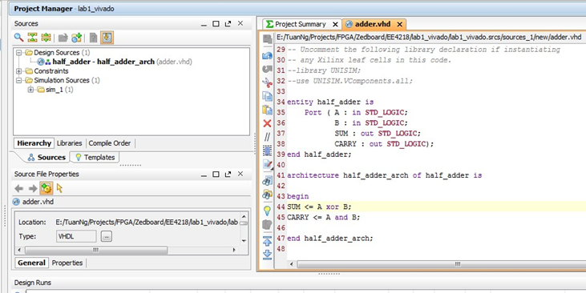
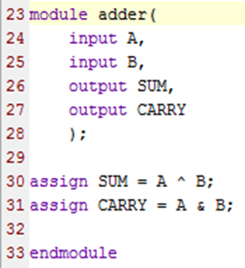
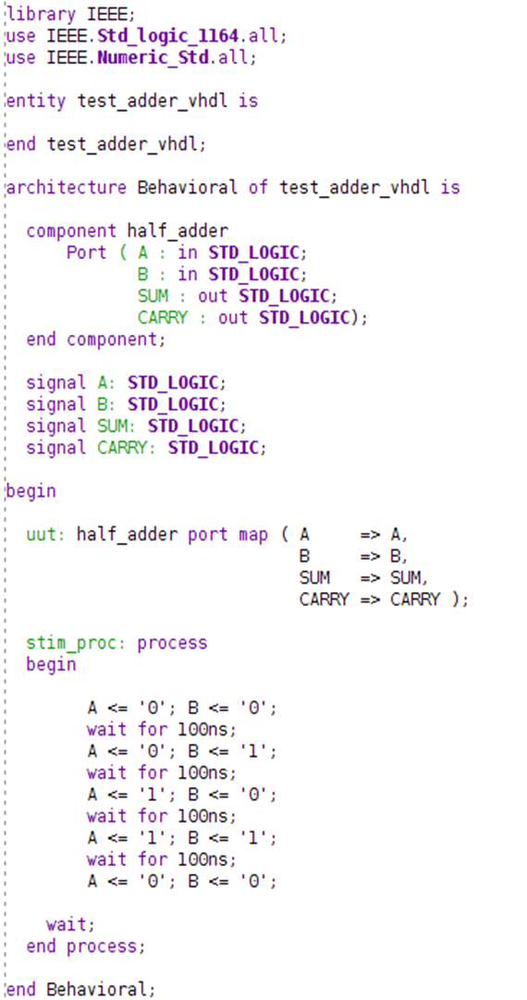
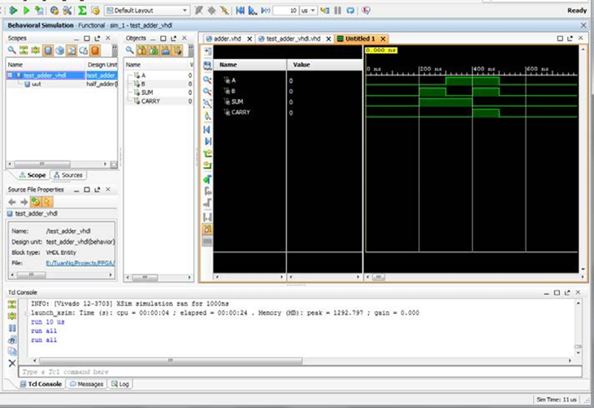
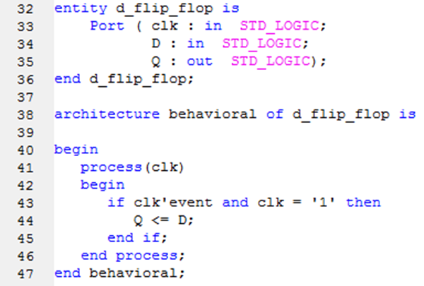
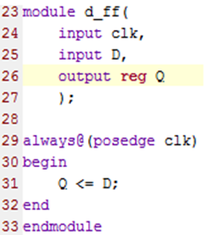
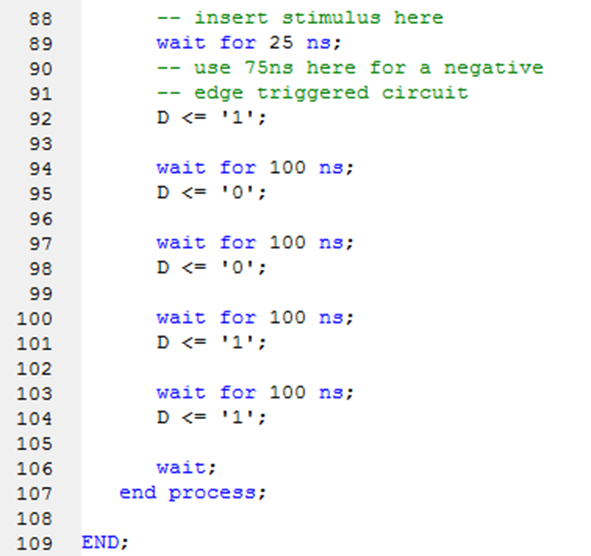
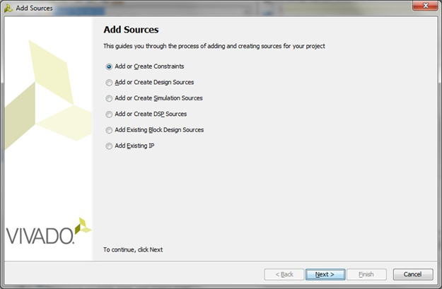

---
search:
  exclude: true
---

# Hardware Implementation Flow

This manual contains step-by-step instructions for the creation of HDL files, simulation, and FPGA implementation. Those who are already familiar with Vivado and FPGA implementation can skip this step and go straight to the [assignment problem](https://canvas.nus.edu.sg/display/ee4218/Lab+1+%3A+Introduction+to+Hardware+Design).

The screenshots were taken on an old version of Vivado. There could be slighter differences for newer versions, though the basic flow remains the same. Also, screenshots are for VHDL. Corresponding Verilog modifications are also provided where applicable.

1.  **Xilinx Vivado: Creating a New HDL Project**

You can run the Xilinx Vivado 201x.x either by clicking the icon on Desktop or going to Start Menu > All Programs > Xilinx Design Tools > Vivado 201x.x > Vivado 201x.x


After launching the ***Vivado***, click on **Create New Project**. The ***Create New Project** *window will appear.


Click **Next** then enter the **Project Name** and **Project Location**

Click **Next** again and make sure the **RTL Project** is selected and the **Do not specify sources at this time** box is checked. Then **Next.**


Now we need to select the FPGA device that we are working on. The board we use is **Kria KV260 Vision AI Starter Kit SOM**

****

Click **Next** to go to **New Project Summary** and **Finish** to create the project.


This is the main workspace of the project that we have just created.

The left pane, **Flow Navigator**, lists all the tools we need to implement the system from making design files to simulating the system, generating the bitstream, and finally, downloading it to the device.

The **Sources** window shows all the files used in the project.


**2\. Xilinx HDL Editor: Adding Sources -- Programming -- Syntax Checking**


Click on **Add Sources** under **Project Manager** in the **Flow Navigator** pane to add the design sources. Make sure that the **Add or Create DesignSources** is selected.


Click **Next** then **Create File.** Select **VHDL**/**Verilog** as appropriate in the drop-down list. Specify the desired file name, for example, **adder** Click **OK** then **Finish**

****


After that, we define the module as in the picture on the left.

Since this is the simple half adder, the input and output ports are only one bit. Click **OK** to generate the HDL file.


New the newly created file is added to the project under **Design Sources.** Double click the file to open it and add the following lines to the architecture / module and save the file.

**VDHL**

**Verilog**

SUM <= A xor B;

CARRY <= A and B;

assign SUM = A ^ B;

assign CARRY = A & B;






Basically, Vivado checks the syntax of HDL code whenever you save the file.

If you want further analysis of the design files without going through the lengthy complete synthesis process, you can click **Open Elaborated Design** under **RTL Analysis** in the **Flow Navigator**. It will also show the schematic of the design if there is no problem with it.


**3A. Behavioural Simulation: Using Test Bench for Combinational Circuits**

Click **Add Sources** and select **Add or Create Simulation Sources.**

Click **Next** then **Create File** to create the new HDL file.

Choose the **VHDL** / **Verilog** file type and specify the name of the testbench, **test_adder_vhdl** / **test_adder_v.** Click **OK** then **Finish**.


The **Define Module** will appear but we do not need to define the I/O ports because this is the testbench. Click **OK** then **Yes** to create the file.


Then you see that there is a Syntax Error in the just created file. Try to open the **Messages** tab and locate the error.


Make the testbench for the **half_adder** module we've just created.


You can make a testbench by yourself or use any other tool to make a template for you base on the I/O interfaces of your design. Add the following stimuli to the HDL test bench code:

|

**VHDL**

 |

**Verilog**




Remember to do a component declaration after the begin of the architecture and before the signal declarations as shown in the code above.

 |  |


Now, we can simulate our design. Ensure that the top-level module is set to test_adder in the simulation settings. In newer versions of Vivado, right-clicking on SIMULATION will bring up simulation settings.

Click **Run Simulation** under **Simulation** then

**Run Behavioral Simulation.**

****


The waveform tab will be opened.

Try to play with the tools on the left to navigate around the waveform. Initially, you may not see the waveform as on the figure because the time resolution is too high, **ps** in this case.

You need to switch to full view. Select **View** **Zoom Fit** or the **Zoom Fit** icon (fifth from top on the panel to the left).




You can click on any place inside the waveform to move the yellow vertical line along the timeline, the corresponding values of input and output are shown in the **Value** column. ***a** *and ***b** *are the stimuli value, in other words, the input. ***sum** *and ***carry** *are the results of the stimuli, in other words, the output. To exit the Simulation, click the **cross** icon as shown in red circle.


**3B. Test Bench for Clocked Circuits**


Similar to steps 1 to 3 of **Section 2**,create the HDL code for a D-flip-flop, as shown in the figure.






After the syntax has been determined to be correct, create a Test Bench for this ***d_flip_flop***. The steps are similar to 1 to 3 of **Section 3A**.

In this case, we need to make a **clk_process** to generate the clock to the design. Please use the clock period of **100 ns**. If you are using Verilog, make sure the first line in your code is `timescale 1ns / 1ps


Insert the stimuli as shown in the figure.

Note that the **wait for 25 ns** / **#25** should preferably be **wait for 75 ns** / **#75** if negative edge-triggered circuits are used. If there is more than one input, these inputs can be changed simultaneously in between the stimuli. In this example, D is the only input that is being changed in between stimuli.




Do the Behavioral Simulation similar to **Step 5** onwards of **Section 3A** to simulate the design.

In this figure, the D-flip-flop is triggered at every positive clock edge.


**4\. FPGA Implementation: Half-Adder (Not required unless we interface with physical pins, and not applicable for Kria board. NOT required for Lab 1 - please read through nevertheless)**


First, make sure that the **half_adder** entity is selected as **Top.**

Check whether the icon is shown next to the design file. If not, right-click at choose **Set as Top**.


Then click **Project Settings** in the Flow Navigator to to verify that the correct device is selected.

This is very important because the configuration file generated by Vivado is unique for each device.


We need to add a constraint file to tell Vivado where we want to map the input/output ports of our design to the actual physical I/O of the FPGA chip.

Click **Add Sources** and select **Add or Create Constraints**.




Specify the configurations as the picture on the left. And click **Finish** to generate the file.


Now we can see the new file **lab1_half_adder.xdc** under the **Constraints.**

Double click to open it, add the constraints below and save it.

*# Mapping A to SW<0>*

*set_property LOC F22 [get_ports A]*

*set_property IOSTANDARD LVCMOS18 [get_ports A]*

*# Mapping B to SW<1>*

*set_property LOC G22 [get_ports B]*

*set_property IOSTANDARD LVCMOS18 [get_ports B]*

*# Mapping SUM to LED<0>*

*set_property LOC T22 [get_ports SUM]*

*set_property IOSTANDARD LVCMOS33 [get_ports SUM]*

*# Mapping SUM to LED<1>*

*set_property LOC T21 [get_ports CARRY]*

*set_property IOSTANDARD LVCMOS33 [get_ports CARRY]*

A better practice is to uncomment the required lines in the **master .xdc** file for the board, and change the input/output port names appropriately in the .xdc file.


Now click the **Run Implementation** tool to generate the bitstream for FPGA.

There may be a dialog asking you to also launch the Synthesis and other processes before generating bitstream. Choose **Yes**.

It takes a while to generate bitstream.


After finishing, Vivado asks you to **Open Implemented Design** to view the layout on FPGA or only view the **Reports**. Choose **Open Implemented Design** then **OK.**

****


The layout of the implemented design (**half_adder**) on FPGA will be shown.

Since this is a very small design, it's hard to see from the full view. You can click on the instance listed in the red box, it will zoom in to its location on FPGA.


Click on **Project Summary** tab to view the utilization of the design. In this design, we only need 1 LUT (Lookup Table) and 4 IO pins.

Can you explain why?


The next steps are to download the bitstream to FPGA.

Before going further, make sure you have connected the **Programming Port** on the board to your computer and it is powered on. If you use the lab PC, all the drivers should be pre- installed.

In addition, verify the position of the jumpers as the picture.


After that, in the **Flow Navigator,** click **Open Target** > **Open New Target**.


The **Open New Hardware Target** wizard will be shown. Click **Next.**

In the **Hardware Server Settings,** select **Local server** then **Next**.

It takes a while for Vivado to detect the connected device.


If it can't detect the device, try to power cycle the board, wait till the drivers are loaded and take the steps again.

If there is no problem, the wizard shows the list of devices connected. Here we have:

-   the JTAG programming interface in the **Hardware Targets (**this JTAG interface is built on the board)
-   and **2 hardware devices (**these devices are on Zynq FPGA chip).

Click the dropdown box of **JTAG Clock Frequency** then select **30000000 Hz.**

Select the **xc7z020_1** device. Click **Next** and **Finish** to save the settings.


Now, we are ready to download the bitstream to FPGA. Click **Program Device** then **xc7z020_1**.


Click **Program** to download the bitstream. The process should take less than 30 seconds.


After that, try to adjust the switches on the board and see the changes of LEDs.


**5\. Notes for Clocked Circuits**


A **create_clock constraint** has to be inserted (uncomment line 8 of the master .xdc file) to tell the synthesis tool that our hardware works based on a 100MHz clock, an info the synthesis tool needs to optimize the circuit appropriately.

*create_clock -add -name sys_clk_pin -period 10.00 -waveform {0 5} [get_ports GCLK]*


The clock given by the board is 100MHz. There are 3 ways to accomplish operations at a lower rate (which may be required for displaying on LEDs or for components which can only work at a slower rate.

**Clock Enable**

Use the idea illustrate about to implement a **clock enable** to slow down the speed of the target counter (count in the example below) / sequential element. This is required if

``` v
always @(posedge clk)\
begin\
count_fast <= count_fast+1;\
if(count_fast == 26'h3FFFFFF)\
count_slow_enable <= 1'b1;\
else\
count_slow_enable <= 1'b0; // **1'b1 for simulation***;\
end

always @(posedge clk)\
begin\
if(count_slow_enable)\
count <= count+1;\
end
```

``` vhdl
process(clk)\
variable count_fast :std_logic_vector(25 downto 0):=(others=>'0');\
begin\
if clk'event and clk='1' then\
count_fast := count_fast+1;\
if count_fast = x"3FFFFFF" then\
count_slow_enable <= '1';\
else\
count_slow_enable <= '0'; -- **'1' for simulation***;\
end if;\
end if;\
end process;

process(clk)\
begin\
if clk'event and clk='1' then\
if count_slow_enable = '1' then\
count <= count+1;\
end if;\
end if;\
end process;
```

**Else, you might have to wait for ****2^26 cycles**** (for a ~1Hz clock) before you can see the effect of 1 clock edge!*

Advantage:  Only one clock is used, which avoids using an additional clock tree. FPGAs have FDREs which can be used for the purpose.

Disadvantage: The critical path is still bounded by 1/(original clock rate).

**Clock Divider**

The idea is to use a large counter (say, a 26-bit counter), and the MSB of the counter as a slow clock. You did this in EE2026.

Advantage:  Simple to implement, allows the critical path to be very long.

Disadvantage: Uses an additional clock tree.

**Clocking Wizard**

We need to select the Clocking Wizard IP in block design, and enter the input and output frequencies. This makes use of phase-locked loops (PLLs) to achieve frequency multiplication or division. You can also make use of a similar functionality available within the Processing System (PS) of Zynq.

Advantage:  Can be used to multiply frequencies too. In the board, modules can go up to 400+ MHz from a 100 Mhz clock. Multiple frequencies which are in phase with each other can be generated. This can be useful in computer systems that have components requiring different clock frequencies which are all in sync.

Disadvantage:  The lowest frequency achievable is about 5 MHz from a 100 MHz clock. This is not sufficient if a very slow apparent clock is required (to show on LEDs, for example).