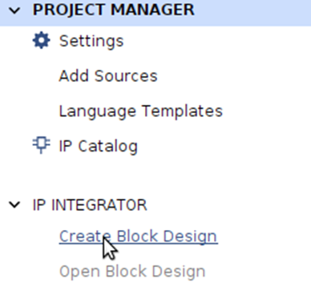
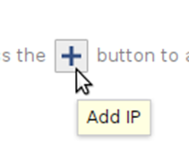
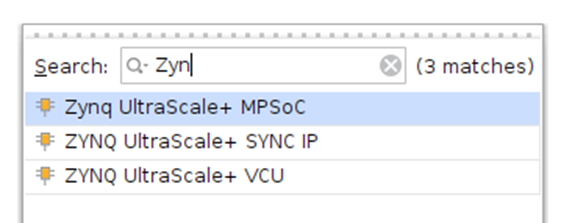
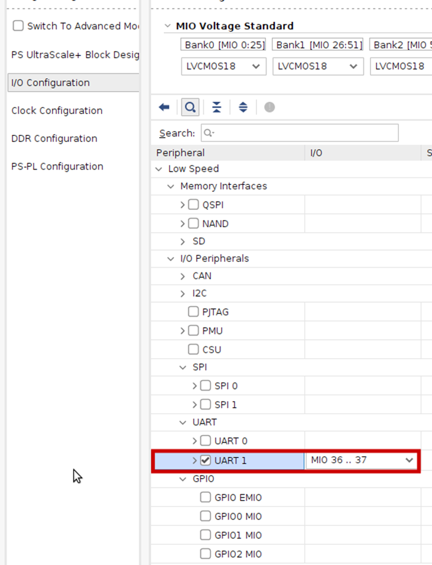
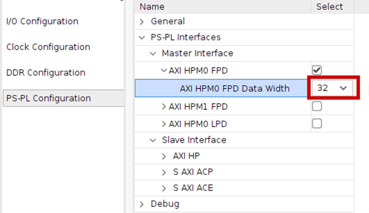
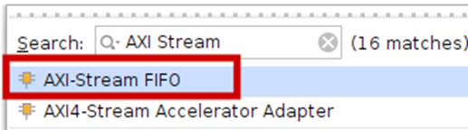
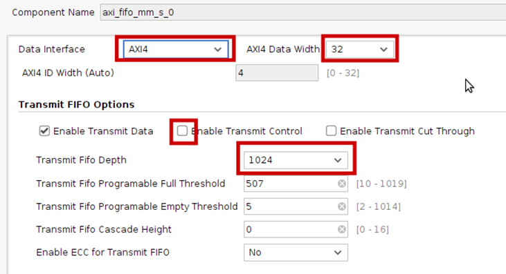
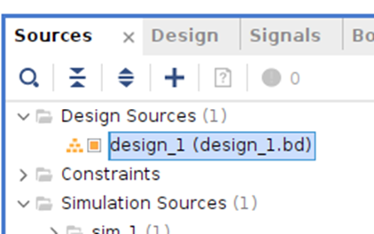

# Creating the Hardware Platform

This page describes how to use Vivado to create a hardware platform using IP Integrator, and to synthesize the hardware into a bitstream. The bitstream is used to configure the FPGA to become the hardware platform that we have created. The bitstream and other hardware info are exported as a .xsa file.

Open Vivado.

File>Project>New

Next> Specify a project name and location>Next>Next>Next>Next> Select the board - go to the boards tab and select _Kria KV260 Vision AI Starter Kit SOM_ >Next>Finish.

Vivado Project manager will now open up.

Under IP Integrator, click Create Block Design.

Accept the default name and options, and click OK.

In the IP Integrator canvas that opens up, click the Add IP button .

Search for and add Zynq UltraScale+ MPSoC

Click on Run Block Automation. This will apply some preset settings for the chip/board. We will be changing this substantially later though.

Accept the defaults and press ok.

Now double-click on the Zynq Ultrascale+ block. You can now see the ultrascale+ block diagram. Have a good look.

No, under I/O configuration, enable UART and you can safely disable everything else. Here, we are configuring the multiplexed IOs, and MIO pins 36 is TX, 37 is RX. We need only those for now.

In the Clock configuration, you can uncheck PL1. PS generates clock(s) for PL. We can have multiple clocks with the same or different frequencies. We need only one 100 MHz clock for PL, at least for now.

In the PS-PL configuration, we can choose AXI HPM0 FPD and uncheck AXI HPM1 FPD. Using AXI HPM0 LPD is also ok (FPD = full power domain. LPD = low power domain). This is the master AXI interface, to which the slaves created in PL will be connected. Select the data width as 32.

You should now see the block below. Click and drag from pl\_clk0 to make a connection to maxihpm0\_fpg\_aclk.

At any point, if you want to beautify the layout, you can click 

The validate your design, i.e., to check if there are incompatible connections / essential connections that are not made, click . If no error or critical warning, we have completed the basic block design.

While this is good enough to do the basic requirements for this lab, let us push ourselves a bit more and get readier for future labs.

Click the + button on the IP Integrator canvas to add an IP. Select AXI-Stream FIFO.  . This IP acts as a bridge between AXI (the bus-based, addressable bus system) to AXI-Stream (point-to-point, non-addressable link). This will be used to integrate our coprocessor into the rest of the system in future labs so that the main processor can send/receive data via AXI. 

While the IP Integrator shows the option for running connection automation, do not do this as yet. Instead, double-click on the AXI Stream FIFO that we added to customize it.

Change the settings as follows, and click OK. Choosing AXI (full AXI) instead of AXI Lite (default) allows the data transfer to be potentially faster, as full AXI can do burst transfers (slave auto-increments addresses so that multiple data can be transferred with a single address). We can disable 'Enable Transmit Control' as we will be doing all the data transfer continuously. Make sure that the Data Width is 32. Increase the Transmit FIFO depth to 1024, as we will be sending more than 512 words later.

Now, click on 

Select both the automations and click OK. 

It will add two blocks - Processor System Reset (to reset peripherals as appropriate - more useful in designs using Microblaze, a soft processor), and an AXI Interconnect (since AXI Stream FIFO has 2 slave interfaces, both of which need to be connected to the same master interface of PS.

Finally, make a loopback connection - connect the AXI\_STR\_TXD to AXI\_STR\_RXD. Since we do not have a co-processor yet, this connection will have the effect of a coprocessor that simply echos (sends back) the data it receives.

You can now optionally click on Regenerate Layout button (the clock-wise symbol) to tidy up the diagram. It should look like below.

It is also a good time to inspect (no action required) the address editor tab. This shows the addresses of the memory-mapped peripherals / interfaces. We have two corresponding to AXI (mentioned as S\_AXI\_FULL) and AXI Lite (S\_AXI) interfaces of the AXI Stream FIFO. You can edit the addresses and ranges if you wish, but unless you have a good reason to (or if you are into numerology), it is fine to leave it as such.

We are done with the block design. Save the block design (Ctrl+S).

Synthesis tools can't synthesize a block design directly. We need to convert the block design into HDL. Under Sources > Design Sources, right-click the .bd file and select 'Create HDL Wrapper'. 

Accept the default, i.e., let 'Vivado manage ...' and click OK.

Now click 'Generate Bitstream' and OK.

Once it is done, File > Export > Export Hardware > Next > Change to Include Bitstream.

Next > (note the path, the default is the project directory itself)> Next > Finish.

For the various steps such as synthesis/implementation etc,  setting the number of jobs equal to the number of cores (maximum in the drop-down list) may cause it to complete faster, esp on Linux. Often, the number appearing by default is 4, which can be changed to a higher number. If you have other programs running in the background, set it to the maximum value in the list minus one or two.

Continue to the instructions for software development using Vitis.
