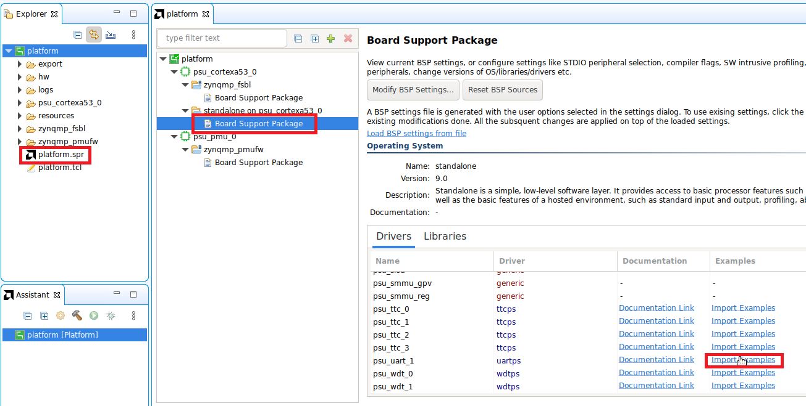
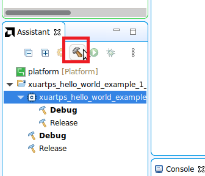
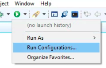
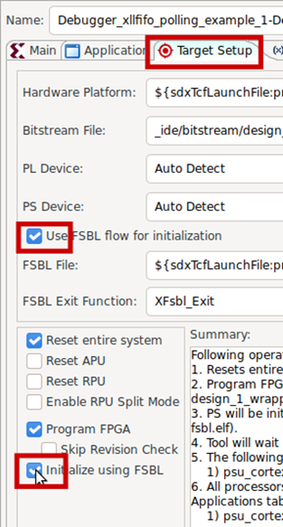

# Software development using Vitis Classic

This page details the steps involved in creating a software application using Vitis, an Eclipse-based IDE, to run on the hardware platform created using Vivado. You should be using a Vitis version that matches your Vivado version.

Note: There are slight differences in GUI and options based on the version. The spirit of what is being done remains the same.

## Vitis Classic

Open the VItis IDE from the start menu or by clicking the desktop icon. Do NOT start from Tools > Launch Vitis IDE from Vivado, as it will launch VS Code based IDE, which we won't be using for now.

Give a **workspace** path. This can be any folder, though it might a good idea to create it under <vivado project path>\\workspace, so that the hardware and software projects are in the same folder. 

This will bring up the IDE. Click **Create Platform Project** (or File>New>Platform Project).

Note: It is also possible to start from Create Application Project, which will prompt you to select/create a Platform Project. You can also choose Create Application Project later, to create applications such as a simple Hello World application.

You will get a new platform project dialog. Enter a **name** for your project, and click Next.

In the next screen, click on the **Create a new platfo.... (XSA)** tab. The click the **Browse** button. A file selector window will open, where you will have to navigate to <vivado project path> and select the **design\_1\_wrapper.xsa** file.  It will take a few seconds to read the .xsa file. Accept the defaults\*. While making sure that the correct .xsa is selected, click **Finish**.

\*OS=standalone, Processor=psu\_cortexa53\_0, Generate boot components (First Stage Boot Loader aka FSBL) checked, etc. If you fancy playing with FreeRTOS (which gives you support for multithreading etc.), you can choose that, though for EE4218, standalone (a library providing basic functions such as stdin/stdout used by prinft/scanf and some other basic functionalities for 'bare metal' programming) is good enough. You can uncheck the Generate boot components option - this will, however, cause an error to be flagged every time you build anything. While this shouldn't affect our functionality, if this can be annoying to you, you can leave it checked. The run configuration (later) is slightly different based on whether you leave it checked or uncheck it. Also, the non-FSBL initialization is generally more prone to random issues such as the debugger hanging.

You will now be presented with the workspace. Under the platform project, click on platform.spr. Click on Board Support Package under standalone on psu\_cortexa53\_0. You can now modify BSP settings if need be (though defaults should be fine), such as including various libraries, selecting the drivers to be used for various peripherals, selecting the std\_in and std\_out peripherals (which should both be psu\_uart1), etc.

You can import examples for the various peripherals. For a start, we can run an example program for psu\_uart1, which is the peripheral we will be using for basic input/output (and will interact with the serial console program, e.g., RealTerm).

In the next screen, select xuartps\_hello\_world\_example. You will now see the application project in the workspace.

Have a look at the main source file, and understand the code.

Now, click build to build the application. If need be, build the platform project (select the platform project and click build) before building the application.

Once the build has been completed, we can run the program. For this, we need to create a Run Configuration.  

Click the drop-down button next to Run, and click **Run Configurations**.

Double click **Single Application Debug**, and you will see a Debugger\_xuartps\_hello\_... under it.  In the Application tab (next to the Main tab), make sure that the **Project**, as well as **Application** fields, are populated. If not, click Browse and select the Project; click Search and select the .elf file.

Configure Target Setup as follows, depending on whether you checked 'Generate Boot Components' (aka FSBL) in an earlier step or not.

Using FSBL -

Not using FSBL - more prone to debugger hanging. This can be used even when FSBL is included in the platform project.

Make sure that you connect the micro USB cable to your computer and the board. Make sure that the board is powered on via the adaptor (it is not powered via USB). RealTerm should be opened and the correct port number should be selected (the lowest numbered among the multiple COM/ttys detected corresponding to the board).

Once that is done, you can click **Apply** and then **Run**. If an Overwrite Boot Mode warning appears, click Yes.

If you are getting errors such as "Could not find ARM device...", the board is likely not detected - either the board is not powered on, or the cable is not connected, driver is not installed, or you did not allow some firewall warning during installation or first run. Check if you can program the FPGA (not run the program) by going to Vitis (in Eclipse IDE top menu) > Program Device > Program (after ensuring that a valid bitstream is present for the Bitstream/PDI field). If it gives the same error, it is certainly about your board not being detected.

If you get this error - "Error while launching program: Memory write error at 0x0. Cortex-A53 #0: EDITR not ready", run the following commands in the XSCT Console (bottom right in Debug perspective\*) in Vitis Classic. This will set the boot mode to JTAG, which is what we want. This may need to be done once everytime the board is powered on.

targets -set -nocase -filter {name =~ "\*PSU\*"}  
mwr 0xff5e0200 0x0100  
rst -system

References:

https://support.xilinx.com/s/question/0D52E00006pW5zTSAS/error-memory-write-error-at-0x0-cortexa53-0-editr-not-ready-when-trying-to-debug-using-platform-cable-ii?language=en\_US  
[https://xilinx.github.io/kria-apps-docs/creating\_applications/2022.1/build/html/docs/bootmodes.html](https://xilinx.github.io/kria-apps-docs/creating_applications/2022.1/build/html/docs/bootmodes.html)

\*You can switch perspectives from **Window > Debug Perspective** to go to debug, and **Window > Design Perspective** to see Explorer, files, etc. You can also switch perspectives easily by selecting the required perspective on the top right as shown below.

For future runs until you disconnect the FPGA (or until you update the bitstream using Vivado), you can uncheck 'Reset Entire System' and 'Program FPGA, and click **Apply**. Otherwise, the FPGA will be re-programmed every time you run a program, which is not necessary. You can also leave these two options permanently unchecked if you program the FPGA through **Xilinx Tools** -> **Program FPGA**.

You should now be able to see the Hello World printed on RealTerm console (the exact message will be different). 

You can run again without opening up the Run configurations window by simply clicking the **Run** button as shown below.

Debugging can also be done to run step by step and inspect the variable values etc. You can also set breakpoints and all other debugging features. The same run configuration created above can also be used for Debug, you just need to click the **Debug** button.

It should automatically change perspective to **Debug Perspective**. If it prompts you if you want to go ahead, click **OK**. The program is now suspended at the first line of the main() function as shown below. You can use the standard debugging controls such as Resume, step over, step into, etc. 

Vitis does not auto-build before running/debugging. If you had changed your program, **remember to build it** before you debug / run it.

Once done, **Disconnect** button in the **Debug Perspective** - either of the two places highlighted in the figure below. If this is not done, you may get a warning that a debug is ongoing.

Beyond Hello World : Running AXI Stream FIFO Example program
============================================================

Go to drivers, and select the example for axi\_fifo\_mm\_s\_0 as shown in the figure below. This assumes a loopback connection in the block diagram / design we created in Vivado.

Run and see the results, which should show a success message in the Serial (UART) console.

## Optional Exercise

Simple input/output : Write a simple program in Vitis to read a character from the console and print that character to the console (echo).

Essentially, you sent out a character from RealTerm console to PSU\_UART1 on the Kria board. The C program running on ARM Cortex A53 reads it from the PSU\_UART1 input buffer (using scanf or UART driver functions), and writes it to the PSU\_UART1 output buffer (using printf or UART driver functions). The PSU\_UART1 will send it over to the RealTerm console, which will then display it.
